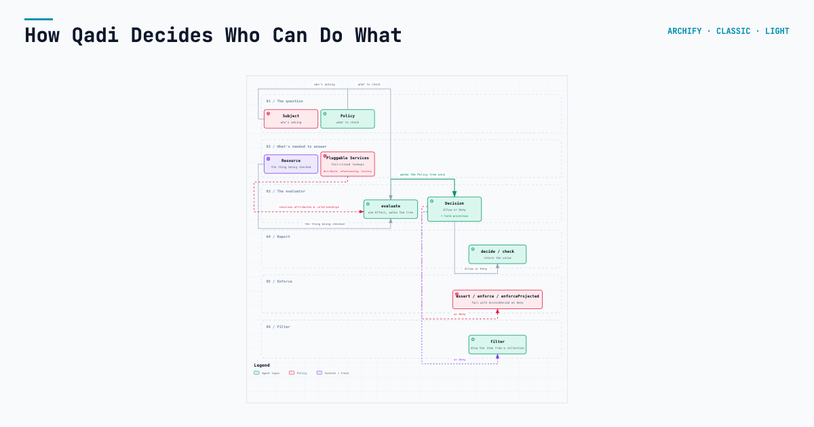
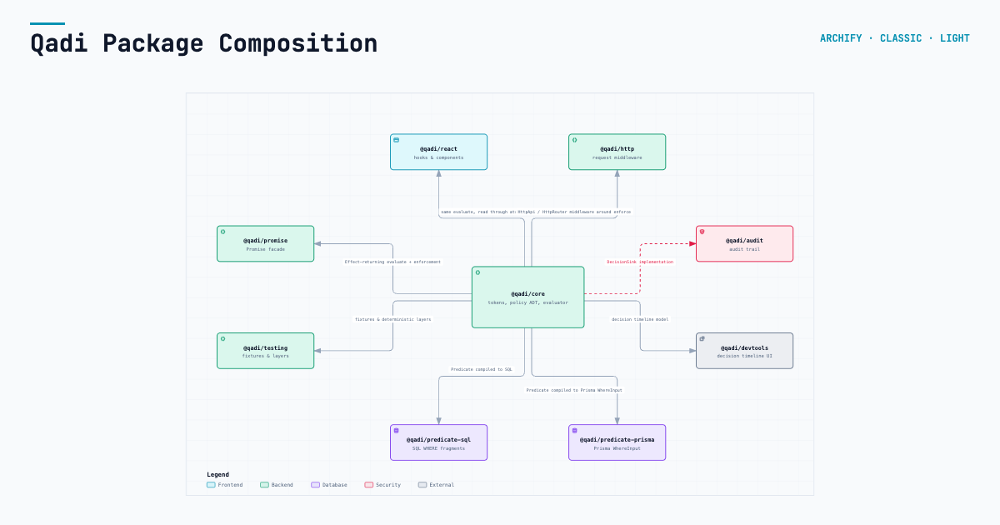

# Qadi

[](https://www.npmjs.com/package/@qadi/core)
[](https://github.com/leaderiop/qadi/actions/workflows/check.yml)
[](./LICENSE)

Effect-native authorization for TypeScript. Permission tokens, a role DAG, a
schema-derived policy ADT, and a single `Effect`-returning evaluator.

Qadi decides whether a subject may perform an action on a resource — and which
parts of the result they're allowed to see. Evaluation is a single `Effect`,
dependencies arrive as `Layer`s, and observability comes from Effect's own
tracing rather than a bespoke logging port.

## Requirements

- Node `>=20.19.0`
- A package manager — this repo's own development is pinned to `pnpm@10.17.1`;
  consuming apps can use npm, yarn, or pnpm
- Effect v4, currently a release candidate (`effect: 4.0.0-rc.112` in this
  workspace). Qadi's public API surfaces Effect classes directly
  (`Context.Service`, `Data.TaggedError`), so pin the same rc line rather than
  a caret range — see `pnpm-workspace.yaml` for the rationale

## Install

```bash
pnpm add @qadi/core effect
```

## Quickstart

Define a permission and a role, write a policy, and enforce it against a
loaded resource — dropping any field the policy doesn't grant:

```typescript
import * as Effect from "effect/Effect";
import * as Layer from "effect/Layer";
import {
  AttributeResolverNone,
  DecisionHistoryUnknown,
  EvaluationIdLive,
  RelationshipResolverNever,
  allOf,
  currentSubjectLayer,
  enforceProjected,
  fromRoles,
  hasPermission,
  hasRole,
  permission,
  role,
} from "@qadi/core";

const readDoc = permission("doc", "read");
const editor = role({ name: "editor", permissions: [readDoc] });

// Module-level constants: a policy built inline would be a new object per call.
const canReadTitle = allOf([
  hasRole("editor"),
  hasPermission(readDoc, { fields: ["id", "title"] }),
]);

const qadiServices = Layer.mergeAll(
  AttributeResolverNone,
  RelationshipResolverNever,
  DecisionHistoryUnknown,
  EvaluationIdLive,
);

declare const loadDocument: (id: string) => Effect.Effect<{
  id: string;
  title: string;
  internalNotes: string;
}>;

const program = loadDocument("doc-1").pipe(
  enforceProjected(canReadTitle),
  Effect.provide(currentSubjectLayer(fromRoles({ id: "u1", roles: [editor] }))),
  Effect.provide(qadiServices),
);
// → { id: "doc-1", title: "…" }   `internalNotes` is not returned.
```

## Not using Effect?

`@qadi/promise` is a thin Promise-returning facade over the same core — every
method forwards to it, nothing re-implements evaluation:

```typescript
import {
  AttributeResolverNone,
  CustomPredicateNone,
  SignatureHistoryNone,
  DecisionHistoryUnknown,
  EvaluationIdLive,
  RelationshipResolverNever,
  hasRole,
  makeSubject,
} from "@qadi/core";
import * as Layer from "effect/Layer";
import { makeQadi } from "@qadi/promise";

const qadi = makeQadi(
  Layer.mergeAll(
    AttributeResolverNone,
    RelationshipResolverNever,
    DecisionHistoryUnknown,
    EvaluationIdLive,
    CustomPredicateNone,
    SignatureHistoryNone,
  ),
);

const subject = makeSubject({ id: "u-1", roles: ["editor"] });

declare const respond: (allowed: boolean) => void;

// A denial is a value; a broken resolver would reject instead.
const handle = async (): Promise<void> => {
  const allowed = await qadi.check(subject, hasRole("editor"));
  respond(allowed);
};
```

## How it works

Subject, policy, and resource go into `evaluate` alongside whatever the policy
needs resolved; the `Decision` that comes out is then either read as a value
or used to gate the resource itself — the difference between "report" and
"enforce" is what each caller does with a deny, not a second code path.



Every enforcement call shares one evaluation path — they differ only in what
they do with a deny.

## Features

- **Permission tokens & role DAG** — typed `resource:action` keys, roles that
  flatten and resolve through inheritance.
- **Schema-derived Policy ADT** — sixteen policy constructors, a matcher DSL,
  security labels, and a JSON codec built and type-checked against the same
  recursive type, not a hand-maintained twin.
- **One evaluator, six enforcement shapes** — `decide` / `check` report;
  `assert` / `enforce` / `enforceProjected` / `filter` enforce — plus streamed
  siblings for collections.
- **Field-level projection** — a decision can return part of a resource, not
  just allow or deny it.
- **Pluggable services, fail-closed by default** — attribute and relationship
  resolvers, decision history, signatures — every one ships a default that
  denies rather than guesses.
- **React bindings** — `QadiProvider`, hooks, `Can`/`Cannot`, SSR hydration,
  built on atoms rather than React state.
- **HTTP middleware** — `HttpApi` and bare-router enforcement, subject
  extraction, a permission registry.
- **SQL & Prisma predicate compilation** — push a policy down into a `WHERE`
  clause instead of filtering in memory.
- **GxP-oriented audit trail** — staged writes, a circuit breaker,
  retention/archival, and e-signature capture.

## Packages

| Package | Description |
| ------- | ----------- |
| `@qadi/core` | Tokens, policy ADT, evaluator, enforcement |
| `@qadi/testing` | Fixtures, deterministic layers, recording resolvers |
| `@qadi/react` | `QadiProvider`, hooks, `Can`/`Cannot`, server-render hydration |
| `@qadi/promise` | A Promise facade for callers who do not use Effect |
| `@qadi/http` | `effect/unstable/http`/`httpapi` bindings — enforcement middleware, subject extraction, permission registry |
| `@qadi/audit` | Audit trail, staging, circuit breaker, retention/archival, e-signature capture, composed onto `DecisionSink` |
| `@qadi/devtools` | A headless decision timeline and a React dock that renders it |
| `@qadi/predicate-sql` | Compiles a `Predicate` into a parameterized SQL fragment — PostgreSQL, MySQL, or SQLite |
| `@qadi/predicate-prisma` | Compiles a `Predicate` into a Prisma `WhereInput` |

`@qadi/features` (Cucumber BDD acceptance tests, private) lives at repo-root
`features/`, not under `packages/` like the ones above.



Every other package is a consumer of `@qadi/core`, never of each other — each
arrow above is the one thing that package actually takes from it.

## Learn more

- [qadi.dev](https://qadi.dev) — docs site: getting started, concepts,
  per-package reference, compliance notes for `@qadi/audit`
- [spec/overview.md](./spec/overview.md) — the full public API surface, kept
  in sync with the code by a merge gate
- [examples/nextjs-newsroom](./examples/nextjs-newsroom) — a runnable Next.js
  demo: client-only, SSR/hydration, separate-origin SSE, and serverless/edge
  topologies

## Why

Qadi exists because there wasn't an authorization library built for Effect.
Effect gives TypeScript typed errors, `Layer`-based dependency injection, and
built-in tracing — but authorization checkers in the ecosystem are written
against a synchronous, throw-on-failure world, with their own ad hoc way of
wiring in the stores and resolvers a real check needs. Qadi is built from
scratch against Effect's model instead of adapted onto it:

- a decision is an `Effect`, so evaluation composes, retries, and traces the
  way the rest of an Effect program does;
- dependencies — attribute resolvers, relationship resolvers, decision
  history — arrive as `Layer`s, not singletons or constructor injection;
- a failed lookup travels through the same typed error channel as everything
  else; it is never silently coerced into a denial or a thrown exception.

The policy language follows the same principle. Policies persist and get
re-parsed from untrusted storage, so the schema _is_ the type rather than a
hand-maintained mirror of it: the recursive type is written once, and the
`Schema.Codec` is built and type-checked against it — a policy that
round-trips through storage cannot silently come back meaning something else.

> **Status: feature-complete, published.** Every item the
> [roadmap](./spec/roadmap.md) committed to has shipped, and every access-control
> model in the [adoption matrix](./spec/models/00-adoption-matrix.md) is either
> adopted or explicitly declined. All nine packages are published on npm at
> `0.4.0` (verified live against the registry, 2026-09-06) — the same version
> every `packages/*/package.json` carries via the changesets fixed group.

## Development

```bash
pnpm install
pnpm typecheck     # tsc -b across project references
pnpm test          # vitest
pnpm coverage      # thresholds enforced: 90% workspace, 95% core
pnpm lint          # oxlint + house-style checks
pnpm circular      # madge — no circular imports across any package's src/
pnpm test:tstyche  # type-level tests (*.tst.ts)
pnpm test:bdd      # Cucumber acceptance scenarios
pnpm spec:examples # compile every runnable example in spec/
pnpm spec:verify:strict  # specification internal consistency
pnpm spec:api      # the documented API surface matches the real one
pnpm spec:package  # the packed packages install, resolve and authorize
pnpm spec:gates    # the DoD table is the merge gate pnpm check actually runs
pnpm spec:claims   # spec/devtools-spec says why each absence still holds
pnpm spec:publish  # publish-status prose in README/CONTRIBUTING/roadmap/website matches package.json
pnpm bench         # dispatch and evaluation throughput (measurement, not a gate)
pnpm mutation      # Stryker on packages/core, the devtools model, predicate-sql, predicate-prisma, audit, http
pnpm check         # all twenty-four gates, in order
```

`pnpm install` runs the root `prepare` script, `effect-tsgo patch`. That command
belongs to `@effect/tsgo` (a devDependency, not something this repo wrote) and it
mutates `node_modules` on purpose: it backs up `node_modules/typescript/lib/tsc`
as `tsc.original` and replaces it with `@effect/tsgo`'s own build — TypeScript-Go
plus the Effect Language Service plugin — so `pnpm typecheck`, `tsc -b`, and any
editor pointed at this workspace's `typescript` get Effect-specific diagnostics
(missing context, floating effects, `catchTags`' object form, and the rest of
`@effect/language-service`'s rule set) for free, with no second toolchain to
install or keep in sync. The patch does not survive a reinstall — `prepare` reapplies
it every time `node_modules` is rebuilt, which is why it is wired there rather than
run once by hand. `npx @effect/tsgo unpatch` restores the original `tsc`; see
`node_modules/@effect/tsgo/README.md` for the rest of its CLI.

`pnpm check` is the merge gate, and [CI](./.github/workflows/check.yml) runs that
one command — not its own list of steps, so the two cannot drift apart. Every number
in the specification up to CCR-QD-035 was produced by a person running it by hand.

Conventions are in [`AGENTS.md`](./AGENTS.md) and are enforced, not merely
documented: `scripts/check-house-style.mjs` fails the build on `async`/`await`,
raw `Promise`, barrel `effect` imports, type assertions, ambient clock/UUID
access, and any `switch` beyond the four declared hot-path dispatchers — in
production source.

`packages/core/test/v4-api-smoke.test.ts` is a canary pinning the Effect v4 APIs
the design depends on. Effect v4 is in beta; if a bump renames something, that
test fails first.

## Contributing

[`CONTRIBUTING.md`](./CONTRIBUTING.md) is a short index — "I'm changing X"
maps to the exact `AGENTS.md` section or spec doc that governs it, rather than
a tutorial.

## License

MIT — see [LICENSE](./LICENSE). Copyright (c) 2026 Mohammad AL Mechkor.
